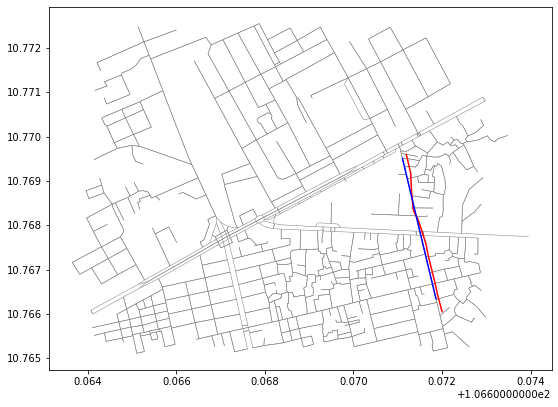

# Map-matching with OSMnx & HMM (Hidden Markov Models)

Matching GPS logs data to existing network.

## Description

Use OSMnx to get OSM network, HMM to matching GPS logs to edges.

Next step will be get projection of GPS logs into edges.

## Getting Started



``red line: gps logs trace.``

``blue line: matching trace in network.``

HMM explained: lorem ipsum...

<hr>

### Dependencies
* OSMnx: Boeing, G. 2017. [OSMnx: New Methods for Acquiring, Constructing, Analyzing, and Visualizing Complex Street Networks](https://geoffboeing.com/publications/osmnx-complex-street-networks/). Computers, Environment and Urban Systems 65, 126-139. [doi:10.1016/j.compenvurbsys.2017.05.004](https://doi.org/10.1016/j.compenvurbsys.2017.05.004)
* HMM: implemented in article [Map matching over-simplified](http://kuanbutts.com/2020/08/25/simplified-map-matching/) by **kuan butts**

<!-- ### Installing

* How/where to download your program
* Any modifications needed to be made to files/folders

### Executing program

* How to run the program
* Step-by-step bullets
```
code blocks for commands
```

## Help

Any advise for common problems or issues.
```
command to run if program contains helper info
``` -->
<!-- 
## Authors

Contributors names and contact info

ex. Dominique Pizzie  
ex. [@DomPizzie](https://twitter.com/dompizzie)

## Version History

* 0.2
    * Various bug fixes and optimizations
    * See [commit change]() or See [release history]()
* 0.1
    * Initial Release

## Acknowledgments

Inspiration, code snippets, etc.
* [awesome-readme](https://github.com/matiassingers/awesome-readme)
* [PurpleBooth](https://gist.github.com/PurpleBooth/109311bb0361f32d87a2)
* [dbader](https://github.com/dbader/readme-template)
* [zenorocha](https://gist.github.com/zenorocha/4526327)
* [fvcproductions](https://gist.github.com/fvcproductions/1bfc2d4aecb01a834b46) -->